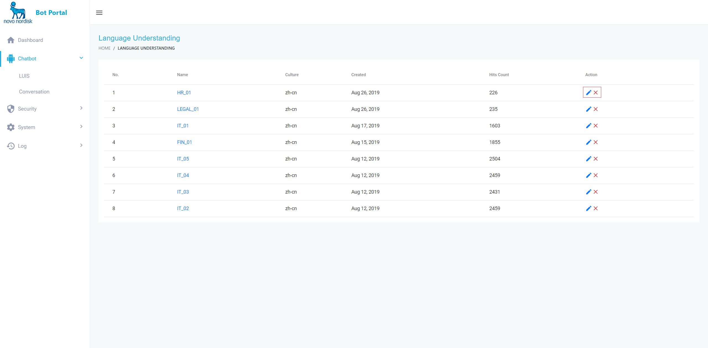
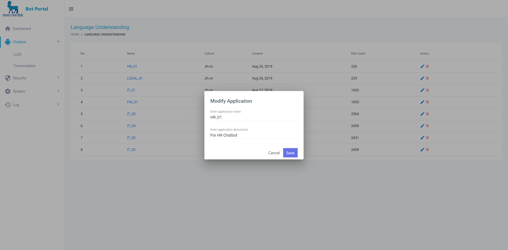
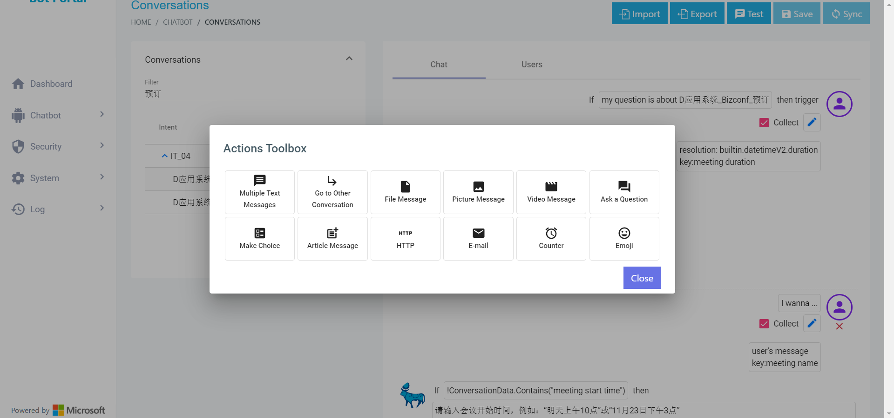
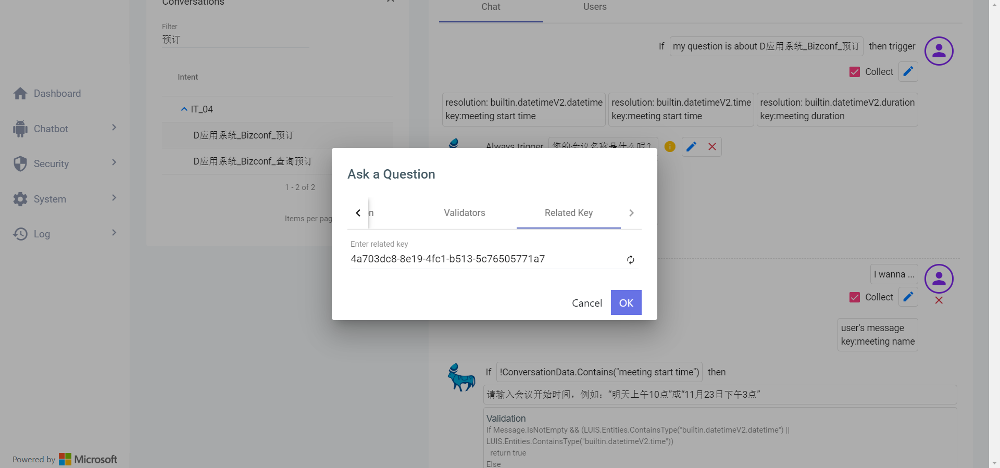
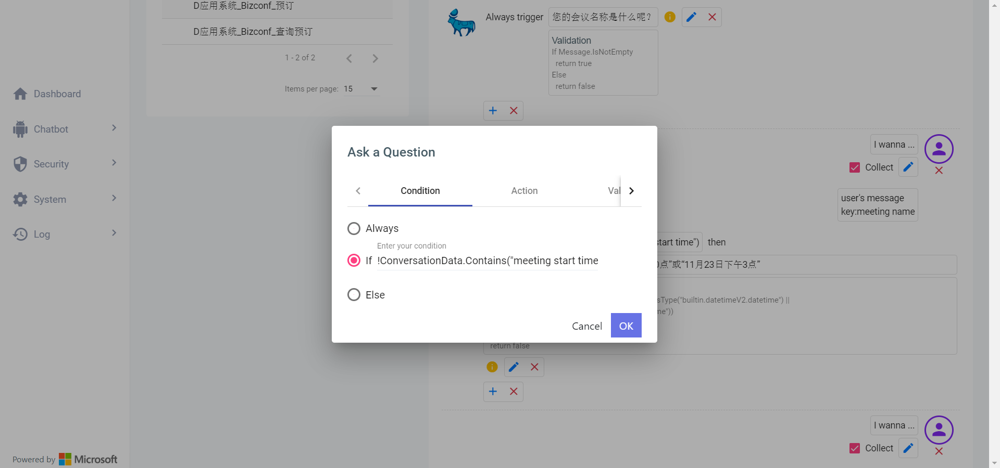
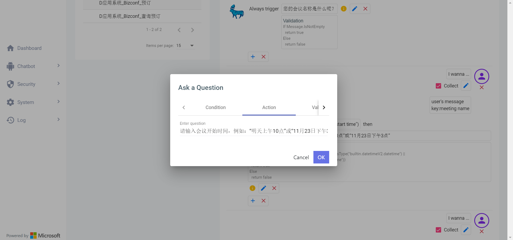
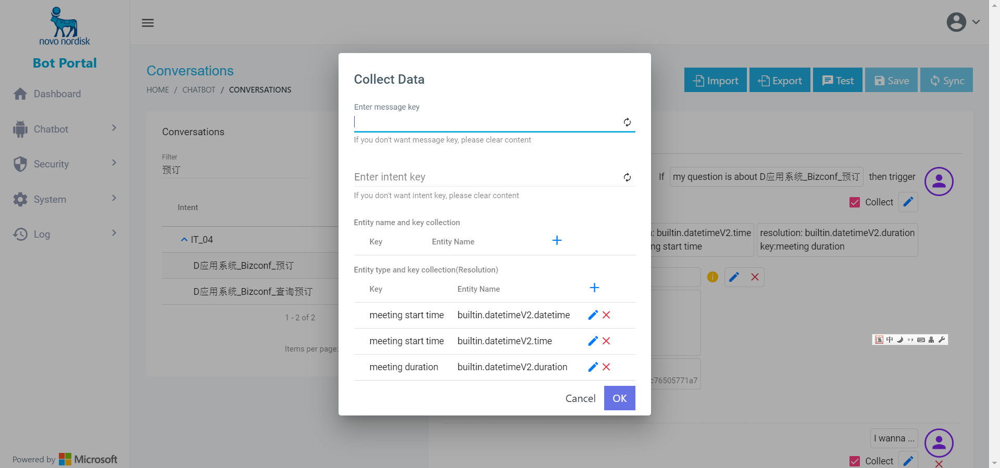
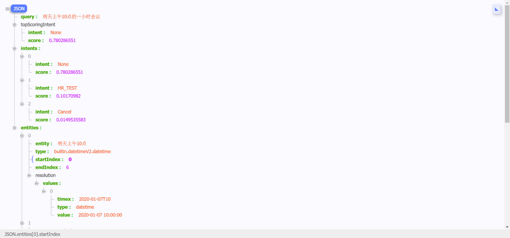

#   **Functional** **Design** **Specification**   

# **Chatbot NuoNuo**   

| **Functional** **Design** **Specification**   **Chatbot NuoNuo** |                                                              |                                                              |
| ------------------------------------------------------------ | ------------------------------------------------------------ | ------------------------------------------------------------ |
|                                                              |                                                              |                                                              |
| **Release** **1.0**                                          |                                                              |                                                              |
|                                                              |                                                              |                                                              |
| **Prepared   by:**                                           |                                                              |                                                              |
| **Liu** **Tao**   **TALU**   Application Manager   NNIT      | Date:            _____________                               | Signature:          ___________________________              |
|                                                              |                                                              |                                                              |
| **Reviewed by:**                                             |                                                              |                                                              |
| **Zhao** **Yin**   **YZa**   Project   Manager NNIT          | Date:              _____________                             | Signature:          ___________________________              |
| **Cong Lin**   **LNC**   System Manager NNSH                 | Date:            _____________                               | Signature:          ___________________________              |
|                                                              |                                                              |                                                              |
| **Approved by:**                                             |                                                              |                                                              |
| **Cong Lin**   **LNC**   System Manager   NNSH           **Xie Tao**   **TAOX**   System Owner | Date:              _____________                   Date:              _____________ | Signature:          ___________________________                   Signature:          ___________________________ |

 

 

**Table of Contents**

 

[1.       Objective. 3](#_Toc184117971)

[2.       Scope. 3](#_Toc184117972)

[3.       Abbreviations and definitions 3](#_Toc184117973)

[4.       Specification requirements 4](#_Toc184117974)

[4.1     Functional Requirement 4](#_Toc184117975)

[5.       Traceability between user requirement and specification requirement ID. 28](#_Toc184117976)

[6.       References 28](#_Toc184117978)

[7.       Change log. 28](#_Toc184117979)

 

*This document has been written according to ‘Manage IT Systems’ (187219)*[1] *and ‘Manage Design and Construction of IT Systems Software’ (187406)*[2]*.*

 

 

# 1.      Objective

本文档为机器人诺诺功能设计文档，主要用于阐述机器人诺诺的业务流程处理方式、主要功能点的功能细节描述，本文档将作为项目团队进行系统实现的依据。

# 2.      Scope

 

本期项目范围如下:

本文详细描述了机器人诺诺（NuoNuo）的功能设计规格说明。主要功能点如下：

n  企业微信聊天通道

n  Teams聊天通道

n  Bizconf视频会议集成

n  转人工服务

n  系统PowerBI报告

n  IT问题报单服务

n  知识库管理服务

n  机器人训练服务

n  用户管理

n  准确性

n  数据备份

n  系统性能

n  系统安全

# 3.      Abbreviations and definitions

 

| **Abbreviation** | **Definition**         |
| ---------------- | ---------------------- |
| NUONUO/诺诺      | 机器人诺诺的简称       |
| NLU              | 自然语言理解           |
| LUIS             | Language Understanding |
| API              | 应用程序编程接口       |

 

 

 

# 4.      Specification requirements

## 4.1   Functional Requirement

| **FS ID** | **Description**                 |
| --------- | ------------------------------- |
| FDS-01-01 | 用户通过企业微信访问机器人诺诺  |
| FDS-02-01 | 用户通过teams访问机器人诺诺     |
| FDS-03-01 | 用户反馈                        |
| FDS-04-01 | Bizconf视频会议预定             |
| FDS-05-01 | 转接人工服务                    |
| FDS-06-01 | IT问题报单服务                  |
| FDS-07-01 | 机器人训练服务                  |
| FDS-08-01 | 知识库管理服务                  |
| FDS-09-01 | 用户管理                        |
| FDS-10-01 | 会话日志                        |
| FDS-11-01 | 使用报告                        |
| FDS-12-01 | 企业微信推送                    |
| FDS-13-01 | 系统应提供数据备份              |
| FDS-14-01 | 性能保障                        |
| FDS-15-01 | 准确性                          |
| FDS-16-01 | 系统安全性能-访问控制           |
| FDS-17-01 | 系统安全性能-系统日志与监控     |
| FDS-18-01 | 系统安全性能-数据与其完整性管理 |
| FDS-19-01 | 系统安全性能-个人数据管理       |
| FDS-20-01 | 系统安全性能-账号与密码管理     |
| FDS-21-01 | 系统安全性能-网络安全与隔离     |
| FDS-22-01 | 系统安全性能-数据保护           |
| FDS-23-01 | 系统安全性能-系统安全增强       |

 

 

| **FS ID**                     | FDS-01-01                                                    |
| ----------------------------- | ------------------------------------------------------------ |
| **Description**               | 用户通过企业微信访问机器人诺诺                               |
| **Functions**                 | 1.代表通过Ipad或者手机端登录企业微信应用,在个人工作台下可以查看到机器人诺诺应用          2.点开机器人诺诺应用以后会看到应用主页面的功能菜单页面      3.代表通过触控点击页面下面的菜单选项（IT风云，新员工，财务采购）开始快捷发问。      4.代表也可以直接输入IT， 财务，采购相关问题对机器人直接发问。      5.代表也可触控点按“按住说话”以语音方式对机器人发问。    |
| **Data**                      | N/A                                                          |
| **Non-functional attributes** | N/A                                                          |
| **Environment**               | N/A                                                          |

 

| **FS ID**                     | FDS-02-01                                                    |
| ----------------------------- | ------------------------------------------------------------ |
| **Description**               | 用户通过teams访问机器人诺诺                                  |
| **Functions**                 | 1.代表打开teams，在Teams左侧导航栏中点击“应用”按钮, 在搜索框中输入“诺诺”, 右侧会弹出搜索结果机器人诺诺，点击“添加”按钮。      2. 弹出应用机器人诺诺，点击“添加”按钮      3. 添加完成后，在Teams左侧导航栏可以看到“机器人诺诺”，以后可以直接点击此应用开启机器人诺诺进行问题咨询。      4.受微软限制，目前teams之支持文本发问， 不支持语音发问 |
| **Data**                      | N/A                                                          |
| **Non-functional attributes** | N/A                                                          |
| **Environment**               | N/A                                                          |

 

| **FS ID**                     | FDS-03-01                                                    |
| ----------------------------- | ------------------------------------------------------------ |
| **Description**               | 用户反馈                                                     |
| **Functions**                 | 机器人回答完毕后，提示用户对答案内容反馈， 用户点击相应图标提交    |
| **Data**                      | N/A                                                          |
| **Non-functional attributes** | N/A                                                          |
| **Environment**               | N/A                                                          |

 

 

| **FS ID**                     | FDS-04-01                                                    |
| ----------------------------- | ------------------------------------------------------------ |
| **Description**               | Bizconf视频会议预定                                          |
| **Functions**                 | 1. 视频会议预定：代表用户可通过2种方式启动视频会议预定。   a. 用户可以通过点击企业微信底部快捷菜单 IT风云，再点击预定视频会议，最后点击页面中的“预定视频会议”即可启动。      b. 用户也可直接在文本框中输入预定会议，或其他预定会议相关预料也可启动      2.输入会议名称：      3.输入会议开始时间：可使用任意时间描述格式      4.输入会议时长：可使用任意时长描述格式      5.机器人诺诺回复预订成功的Bizconf会议信息给用户    |
| **Data**                      | N/A                                                          |
| **Non-functional attributes** | N/A                                                          |
| **Environment**               | N/A                                                          |

 

 

| **FS ID**                     | FDS-05-01                                                    |
| ----------------------------- | ------------------------------------------------------------ |
| **Description**               | 转人工服务                                                   |
| **Functions**                 | 1.代表用户在企业微信或teams中与诺诺机器人的聊天框中输入“转人工”或其他与转人工意图的相关语料后，系统会分配人工客服直接与代表用户对话。      2.根据服务流程，转人工服务只在工作时间可用 |
| **Data**                      | N/A                                                          |
| **Non-functional attributes** | N/A                                                          |
| **Environment**               | N/A                                                          |

 

| **FS ID**                     | FDS-06-01                                                    |
| ----------------------------- | ------------------------------------------------------------ |
| **IT**                        | IT问题报单                                                   |
| **Functions**                 | 1.代表用户可通过诺诺机器人聊天界面上报IT问题，代表用户在企业微信或teams中与诺诺机器人的聊天框中输入“IT问题报单”或其他与IT问题报单意图的相关语料后，系统会提示用户输入问题的文字或语音描述。用户也可点击聊天页面中“IT问题报单”的快捷链接启动报单服务           2.在输入文字或语音描述后，系统提示用户继续输入问题截图。用户此时可以选择点击微信下方上传按钮上传截图   3. 如无截图，可在输入框直接输入“完成”   4. 如用户此时行取消上传，可在输入框直接输入“取消”   5. 成功上报的IT问题会传送到“ITsupport”公邮， 由IT值班人工处理。由于人力资源限制，目前系统只支持IT问题的上报和处理。    |
| **Data**                      | N/A                                                          |
| **Non-functional attributes** | N/A                                                          |
| **Environment**               | N/A                                                          |

 

| **FS ID**                     | FDS-07-01                                                    |
| ----------------------------- | ------------------------------------------------------------ |
| **Description**               | 机器人训练服务                                               |
| **Functions**                 | 1.此部分功能为微软LUIS产品设计，无任何代码定制       2.系统管理员登录机器人训练平台<https://luis.azure.cn/applications>      3. 点击相关意图APP，如“IT_01”              4.管理员可选择点击create添加新的意图      5.输入意图名称：如“A账号密码_密码重置”，点击Done          6.输入多条和意图相关的语料（example user input）              5.分别点击train，test, publish以完成对此意图的训练   6.用户也可点击现有意图并对语料进行更新，以提高训练和意图命中效果 |
| **Data**                      | N/A                                                          |
| **Non-functional attributes** | N/A                                                          |
| **Environment**               | N/A                                                          |

 

| **FS ID**                     | FDS-08-01                                                    |
| ----------------------------- | ------------------------------------------------------------ |
| **Description**               | 知识库管理服务                                               |
| **Functions**                 | 1. 系统管理员登录机器人系统Portal系统管理员登录机器人训练平台<https://novonordisk.chinacloudsites.cn/>       2. 点击左侧菜单chatbot，再点击Conversations          2.选择要编辑答案的意图，如A账号密码_Bitlocker_解锁（意图应预先在LUIS站点创建，训练和发布），点击new action          3.选择不同格式的媒体来完成答案的编辑。如文本格式可以点击“Multiple text Messages”          4.点击“+“号，输入答案的文字部分         5.点击OK返回， 继续点击“Add new Action”添加答案的图片部分， 点击“upload image”图标          6.上传图片文件，点击OK      7.完成答案的编辑      8.分别点击Save， Test，Sync， 完成答案的保存，测试，与同步   9.机器人诺诺支持的所有类型或格式的答案详见如下   a．文本   c．附件   d．图片   e．视频   f．提问   i．链接   j．email   k．计数器   l．表情 |
| **Data**                      | N/A                                                          |
| **Non-functional attributes** | N/A                                                          |
| **Environment**               | N/A                                                          |

 

| **FS ID**                     | FDS-09-01                                                    |
| ----------------------------- | ------------------------------------------------------------ |
| **Description**               | 用户管理                                                     |
| Functions                     | 1.诺诺机器人支持2种用户权限，   Administrators和editors。Administrators保有所有用户权限，Editor对系统有只读权限，且对知识库（conversation）有读，写，导入，导出权限. 权限组的查看与管理可点击管理平台左侧菜单Security->User   groups          2. 诺诺机器人管理平台通过AAD账号登录与验证。用户的添加与权限配置点击管理平台左侧菜单Security->Users      3. 添加新用户可点击 new button   ，输入用户的AAD账号名，密码，email      并为此用户分配用户组, 最后点击“save” 完成.          4. 对于不再管理诺诺管理平台的用户可选择禁用      或直接删除用户    |
| **Data**                      | N/A                                                          |
| **Non-functional attributes** | N/A                                                          |
| **Environment**               | N/A                                                          |

 

 

| **FS ID**                     | FDS-10-01                                                    |
| ----------------------------- | ------------------------------------------------------------ |
| **Description**               | 日志数据                                                     |
| **Functions**                 | 机器人诺诺应可以记录会话，确保数据记录完整性和可分析性。   对于机器人会话日志：   1.系统管理员登录机器人系统Portal系统管理员登录机器人训练平台 <https://novonordisk.chinacloudsites.cn/>   2. 点击右侧菜单“log”，点击conversations， 即可查看用户与机器人的会话日志。   3. 通过输入以下数据和其组合，可快速定位要查找的日志   From date   To date   Intent   User name    Min score   Max score          对于转人工会话日志：   1.系统管理员登录机器人系统Portal系统管理员登录机器人训练平台 https://sd01.novonordiskchina.cn/backstage/dashboard/analysis   2. 点击右侧菜单“log”，点击conversation log， 即可查看用户与人工客服的会话日志。   3. 通过输入以下数据和其组合，可快速定位要查找的日志   客服名   用户名   会话时间    |
| **Data**                      | N/A                                                          |
| **Non-functional attributes** | N/A                                                          |
| **Environment**               | N/A                                                          |

 

| **FS ID**                     | FDS-11-01                                                    |
| ----------------------------- | ------------------------------------------------------------ |
| **Description**               | 使用报告                                                     |
| **Functions**                 | 1.系统管理员登录机器人系统Portal <https://novonordisk.chinacloudsites.cn/>   2. 点击 Dashboard查看以下报告：   用户与会话报告   活跃意图报告   活跃用户报告   3. 用户可通过输入conversation的开始和结束时间调整报告的时间范围    |
| **Data**                      | N/A                                                          |
| **Non-functional attributes** | N/A                                                          |
| **Environment**               | N/A                                                          |

 

| **FS ID**                     | FDS-12-01                                                    |
| ----------------------------- | ------------------------------------------------------------ |
| **Description**               | 企业微信推送                                                 |
| **Functions**                 | 当管理员有发送信息给用户的需求时，可以通过机器人诺诺实现管理员推送微信消息给指定用户。   登录企业微信后台，点击安全与管理，点击发消息， 选择应用，选自发送范围，编辑消息，点击发送。    |
| **Data**                      | N/A                                                          |
| **Non-functional attributes** | N/A                                                          |
| **Environment**               | N/A                                                          |

 

| **FS ID**                     | FDS-13-01                                                    |
| ----------------------------- | ------------------------------------------------------------ |
| **Description**               | 系统应提供数据备份                                           |
| **Functions**                 | 诺诺机器人由Azure提供备份服务    |
| **Data**                      | N/A                                                          |
| **Non-functional attributes** | N/A                                                          |
| **Environment**               | N/A                                                          |

 

 

| **FS ID**                     | FDS-14-01                                                    |
| ----------------------------- | ------------------------------------------------------------ |
| **Description**               | 性能保障                                                     |
| **Functions**                 | 系统由Azure监控CPU性能以确保应用的相应速度。    |
| **Data**                      | N/A                                                          |
| **Non-functional attributes** | N/A                                                          |
| **Environment**               | N/A                                                          |

 

 

 

| **FS ID**                     | FDS-15-01                                                    |
| ----------------------------- | ------------------------------------------------------------ |
| **Description**               | 机器人在上线6个月后达到并保持85%以上的回答准确率             |
| **Functions**                 | 通过Azure LUIS训练平台确保机器人训练的准确性    |
| **Data**                      | N/A                                                          |
| **Non-functional attributes** | N/A                                                          |
| **Environment**               | N/A                                                          |

 

 

| **FS ID**                     | FDS-16-01                                                    |
| ----------------------------- | ------------------------------------------------------------ |
| **Description**               | 系统安全性能-系统访问控制                                    |
| **Functions**                 | •普通用户通过企业微信作为唯一入口会对用户进行鉴权，未经授权的访问将无法进行访问操作。 |
| **Data**                      | N/A                                                          |
| **Non-functional attributes** | N/A                                                          |
| **Environment**               | N/A                                                          |

 

 

| **FS ID**                     | FDS-17-01                                                    |
| ----------------------------- | ------------------------------------------------------------ |
| **Description**               | 系统安全性能-日志与监控                                      |
| **Functions**                 | `以下活动需被监控并保留日志，日志保留至少6个月``•用户的会话日志，包括与机器人的和与人工的``•安全事件的审计追踪如账号的增删改，用户登录``•机器人知识库的更新``•个人数据的更改`   1.系统管理员登录机器人系统Portal系统管理员登录机器人训练平台 <https://novonordisk.chinacloudsites.cn/>   2. 点击右侧菜单“log”，点击activities， 即可查看以上的日志。          ` ` |
| **Data**                      | N/A                                                          |
| **Non-functional attributes** | N/A                                                          |
| **Environment**               | N/A                                                          |

 

| **FS ID**                     | FDS-18-01                                                    |
| ----------------------------- | ------------------------------------------------------------ |
| **Description**               | 系统安全性能-数据与其完整性管理                              |
| **Functions**                 | `根据BizConf的校验机制,通过提供的账号密码接口获取认证的token确认身份,，传输中内容通过http的SSL端到端的加密和解密，确认身份有效性和内容的有效性和完整性` |
| **Data**                      | N/A                                                          |
| **Non-functional attributes** | N/A                                                          |
| **Environment**               | N/A                                                          |

 

 

 

| **FS ID**                     | FDS-19-01                                                    |
| ----------------------------- | ------------------------------------------------------------ |
| **Description**               | 系统安全性能-个人数据管理                                    |
| **Functions**                 | `诺诺机器人的个个人数据主要在存在本地知识库中并通过管理平台图形化界面单独编辑，所有对知识库的编辑包括增删改都会产生日志并被记录保留。目前系统无自动删除日志的设置。` |
| **Data**                      | N/A                                                          |
| **Non-functional attributes** | N/A                                                          |
| **Environment**               | N/A                                                          |

 

| **FS ID**                     | FDS-20-01                                                    |
| ----------------------------- | ------------------------------------------------------------ |
| **Description**               | 系统安全性能-账号与密码管理                                  |
| **Functions**                 | `•普通用户通过企业微信的有效身份访问诺诺机器人，无需输入密码。``•机器人portal特权用户包括administrator 和 Editor 2种角色。"以上账号登录机器人portal通过AAD single sign on，密码由Azure提供加密机制``•转人工portal特权用户包含 chatbot管理员，转人工管理员，转人工Agent3种角色。以上账号通过微信扫码登录，无需手工输入密码`` ` |
| **Data**                      | N/A                                                          |
| **Non-functional attributes** | N/A                                                          |
| **Environment**               | N/A                                                          |

 

| **FS ID**                     | FDS-21-01                                                    |
| ----------------------------- | ------------------------------------------------------------ |
| **Description**               | 系统安全性能-网络安全与隔离                                  |
| **Functions**                 | `•目前系统有测试和生产2套环境。``•计划实施网络安全措施包括应用程序网关，Palo Alto firewall, WAF,anti-DDos` |
| **Data**                      | N/A                                                          |
| **Non-functional attributes** | N/A                                                          |
| **Environment**               | N/A                                                          |

 

| **FS ID**                     | FDS-22-01                                                    |
| ----------------------------- | ------------------------------------------------------------ |
| **Description**               | 系统安全性能-数据保护                                        |
| **Functions**                 | `• 数据在传输过程中通过SSL进行加密 ``• 数据在存储中使用Azure自带加密机制` |
| **Data**                      | N/A                                                          |
| **Non-functional attributes** | N/A                                                          |
| **Environment**               | N/A                                                          |

 

| **FS ID**                     | FDS-23-01                                                    |
| ----------------------------- | ------------------------------------------------------------ |
| **Description**               | 系统安全性能-系统安全增强                                    |
| **Functions**                 | `•机器人聊天线程由微信或teams控制。``•转人工用户聊天线程保留15分钟``•转人工SD聊天线程保留6小时` |
| **Data**                      | N/A                                                          |
| **Non-functional attributes** | N/A                                                          |
| **Environment**               | N/A                                                          |

# 5.      Traceability between user requirement and specification requirement ID 

此内容会包含在190101. Chatbot NuoNuo.IT Traceability Matrix v1.0文档中。

~~ ~~

# 6.      References

[1]  Doc. no. 187219, Manage IT Systems

[2]  Doc. no. 187406, Manage Design and Construction of IT Systems Software

[3]  190101. Chatbot NuoNuo.IT Traceability Matrix v1.0

# 7.      Change log

 

| **Version   no.** | **Date**     | **Change   description**         |
| ----------------- | ------------ | -------------------------------- |
| 0.1               | 25-Dec-2023  | 建立初版文档                     |
| 0.2               | 12-July-2024 | 补充非功能性需求，细化功能性需求 |
| 1.0               | 18-July-2024 | 补充安全性功能                   |

 